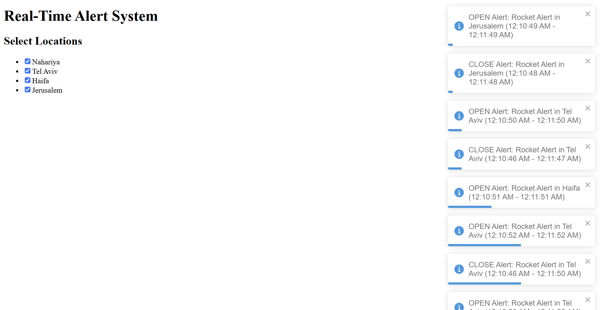
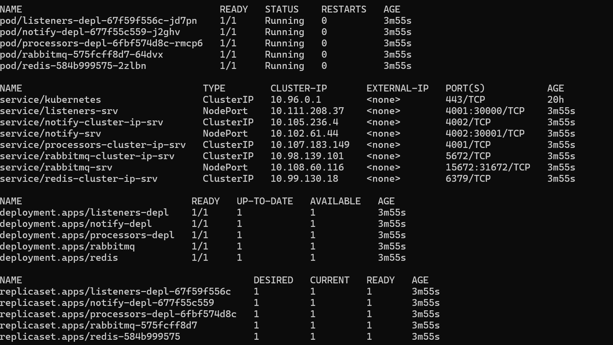

# Alert Distribution System🚨

- [Intro](#intro)
- [Overview](#overview)
- [Setup](#setup)
- [Notes](#notes)

## Intro

This system receives emergency alerts from various sources in real-time and transfers them to a vast number of clients, informing them of the danger⚠️.

## Overview

This repo consists of the built-in front-end React.js application, and a back-end, microservices-based Node.js server consisting of three microservices written in TypeScript.

The root folder contains the frontend folder given in the task, the backend folder which contains most of the content - each microservice has a folder. It also contains a Skaffold file - will be explained later. There is the assets folder for the screenshots and docs folder for more profound documentation - design motivation.

### Alert Generator (alert-generator)🤖

A script that mimics a real-life alert resource.
Sends random alerts, at a frequency set by the user.
Written in TypeScript.

### Listener Microservice (listener-srv)📡

The data's entry point to the back-end.
Responsible for handling the HTTP requests containing the raw data sent from the source. The listener(s) listen to incoming data and enqueue it in the RabbitMQ message broker.

### RabbitMQ🐰

The message broker between the Listener and the Processor Microservice (see the following). It is deployed in the cluster within a deployment of its own.

### Processor Microservice (process-srv)⚙️

The actual "worker". Processes the data by aggregating events using Redis, also responsible for handling data duplication. Fetches the data from RabbitMQ and transfers it to the Notify Microservice using Redis Pub-Sub functionality.

### Redis📩

Stores event data for event aggregation and is used as a message distributor to the Notify Microservice by broadcasting the messages to all the instances. It is deployed in the cluster within a deployment of its own.

### Notify Microservice (notify-srv)🔔

Informs the clients of new alerts by subscribing to Redis, getting the events' data from the designated channel which the events are published to by the Processor Microservice. Informs the clients of new alerts by leveraging the socket.io library.

For more information about the challenges of the design, scaling and more, see the [Design Docs](./docs/Design_README.md)

## Setup

The guide assumes you have Node.js and Docker installed on your PC (Docker's k8s engine was used for the development of this).

`git clone https://github.com/Falupi22/alert-system-exercise`

Now open cmd in the folder generated. Then type the following:

`cd backend && cd ./<folder-name> && yarn install`

Each folder contains the code (./src) and the yaml files (./infra).
Do this for all the microservices.
Then, enter 
``cd ../frontend && yarn install``

If you are in the frontend folder, run `yarn start` to run the app.
If you're in a microservice's folder, type `yarn dev` to run a single, local instance of it.
It is highly recommended to run local instances of them using docker-compose, If you still wish to run the whole system in local mode, see the `config.ts` file of each microservice for netwrok configuration.
The ports 30000 and 30001 were used arbitrarily for the entry point of some components in the system (using k8s), but this can be changed by setting NodePort values within the corresponding yaml files.

If you wish to run it within a docker, run the following:
``yarn build``
``cd <dest-folder-srv> && docker compose up``
Dont forget to dockerize rabbitmq and redis found in backend/infra as well.

A fully working system, receiving data, should result in the following:

### Skaffold

Skaffold is an easy way to deploy the entire back-end as a local Kubernetes cluster using only one command! The skaffold.yaml file contains all the information necessary for deploying the app. It also watches for file changes and updates the cluster automatically.

To install - https://skaffold.dev/docs/install/

Once ready, make sure to locate yourself in ./backend, and then type
`skaffold dev`

It might take a few minutes, but once it's ready, it handles everything.
You can also check if the system is set up by typing in the cmd
`kubectl get all`

You should see the following:

## Notes

- There is a NodePort service for the UI management tools of the RabbitMQ. It is included within the yaml but is not necessary for a functioning system.
  
- The frontend was tweaked due to mismatching names of parameters within the task (sentTime - startTime, duration - endTime). I sticked with the names given by the task.

- The port of the socket IO server has been replaced (4000-30001) for convenience issues (NodePort port is usually a 5-digit number).