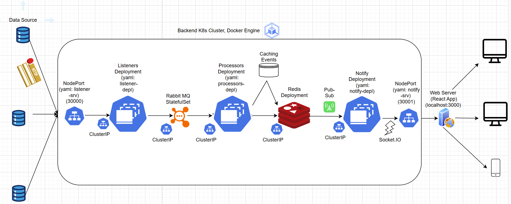

# Motivation For The System Design🔥

- [Motivation For The System Design🔥](#motivation-for-the-system-design)
  - [Design📐](#design)
  - [Requirements📝](#requirements)
  - [Challenges🤔](#challenges)
  - [Solutions💡](#solutions)
    - [Microservices⚙️](#microservices️)
    - [RabbitMQ:🐰](#rabbitmq)
    - [Redis📩](#redis)
    - [Socket IO (websocket)⚡](#socket-io-websocket)

## Design📐

## Requirements📝
The system needs to be scalable because there is an increasing number of clients (up to the whole country), which become more available during specific times of the day. However, this is not permanent and the system must adjust quickly.

It also needs to be highly available and fault-tolerant due to its significance in providing life-saving information to its users. Fault tolerance is a must.

It also needs to be quick in terms of latency. Once the data is received in the system, it should be conveyed as quickly as possible to the clients. Every second is important!

## Challenges🤔

Scalability is a challenge - it requires the developer to make the system scalable. They should look for bottlenecks and find ways to decrease response time for fresh data when more of it arrives. Developing a scalable system is different from traditional ones; more technologies should be considered and the design becomes more complicated.

High availability and fault tolerance are also challenges. It adds more redundancy to the system because it requires more independent middlemen within the system and more backup components.

Low latency is a challenge too. While the other challenges add more redundancy to the system, this one tells the developer to reduce the number of components in the system.

Requirements noted in the task itself are a challenge too because they must be considered in the design of the system.

## Solutions💡

There are a few solutions to the given challenges:

### Microservices⚙️

The truth is that Microservices were noted as a requirement in the task, but I would have used them anyway.

It is scalable! Once the traffic is heavy, another instance of the busy microservice is deployed seamlessly in the cluster.

It is more fault-tolerant - if a microservice crashes, another one comes to the rescue while the other is redeployed.

It is also easier to maintain if they are decoupled correctly. More info can be found in the next section.

There are several different microservices:

- Listener - accepts HTTP requests from the sources.
    Operates on its own (can be duplicated in a deployment) as the endpoint for the backend. Queues the requests. The reason for this isolation is it reduces the chances of crashes and data loss by only storing it in a queue and by that it reduces the rate of requests for processing.
- Processor - Processes the data by aggregating events and remodeling the data (small modifications). Also works as a single unit (can be duplicated in a deployment). Receives data from the queue. Broadcasts the event to all the notify microservices using Redis Pub-Sub functionality.
- Notify - Notifies the user when a new event arrives. Works as a single unit (can be duplicated in a deployment) because the processor does not know all the current events, so it broadcasts the event to all of the notify microservices, which broadcast the event to all of the socket connections of each one of them.   

### RabbitMQ:🐰

The truth is that RabbitMQ was noted as a requirement in the task, but I would have used it anyway.

It provides message persistence, so if some worker crashes the event is kept in the queue until it is consumed by another one.

By this decoupling, it reduces the dependency between the listener and the processor. It also makes it easy to develop in big teams because the team does not rely on shared APIs.

It also supports load balancing, which is very important in high-scale apps, so many microservices can handle any requests at once. It works by subscription of many processor microservices to the queue, and each one consumes at a time, acknowledging the message so it is dequeued from the queue, and requeued (nAcked) if there was a problem with the message processing.

In the project, there is a RabbitMQ deployment.
There is only one queue, and it is used to deliver messages from the listeners to the processors, so many listeners can deliver many events to many processors.

### Redis📩

The truth is that Redis was noted as a requirement in the task, but I would have used it anyway.

Microservices should be stateless, so when one crashes, no data is lost. However, some data should still be accessed quickly, and databases like Postgres and MongoDB are not quick enough for that task.

That's why there is Redis - The in-memory database.
There is a deployment of Redis within the cluster.

It stores information about the event - the location, the start and end time so event aggregation can be performed.

Redis is also used for handling communication between the processor and the notify microservice by leveraging the Pub-Sub functionality. It was requested in the task but it is still a great way to broadcast a message to many subscribers - the notify microservices. It is quick and reliable.

### Socket IO (websocket)⚡
Bidirectional way of client-server communication.

It was required in the task but it is the best way of informing the client of events because it lets the server deliver the data *immediately* without waiting to be polled.
